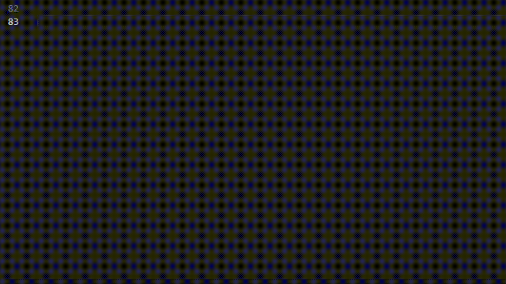

# Pseudocode

<!-- GitHub badges -->

[](https://github.com/jorge-holguin)
[](https://github.com/jorge-holguin/vscode-pseudocodigo/stargazers)
[](https://github.com/jorge-holguin/vscode-pseudocodigo/forks)
[](https://github.com/jorge-holguin/vscode-pseudocodigo/commits)
[](https://github.com/jorge-holguin/vscode-pseudocodigo/pulls)
[](https://github.com/jorge-holguin/vscode-pseudocodigo/blob/main/LICENSE)
[](https://www.javascript.com/)

[](https://snyk.io/test/github/jorge-holguin/vscode-pseudocodigo)


Una extensión simple para el resaltado de sintaxis de pseudocódigo genérico.

El resaltado de sintaxis existe para múltiples variantes de palabras clave de pseudocódigo comunes, lo que te permite usar tu propio estilo sin limitarte a un formato específico.

## Tabla de Contenidos:
- [Pseudocode](#pseudocode)
  - [Tabla de Contenidos:](#tabla-de-contenidos)
  - [Características](#características)
    - [Resaltado de Sintaxis](#resaltado-de-sintaxis)
      - [Palabras Clave:](#palabras-clave)
      - [Operadores:](#operadores)
      - [Funciones:](#funciones)
      - [Clases:](#clases)
      - [Estructuras:](#estructuras)
      - [Cadenas de Plantilla:](#cadenas-de-plantilla)
    - [Fragmentos de Código](#fragmentos-de-código)
    - [Palabras Clave Personalizables](#palabras-clave-personalizables)

## Características

### Resaltado de Sintaxis

Los siguientes elementos tienen resaltado de sintaxis. Los sinónimos están separados por espacios.

#### Palabras Clave:
```
escribir imprimir e.g. escribir "Hola Mundo"
leer
si
sino
intentar
capturar
importar
mientras
para
paracada
retornar
definir e.g. definir x <- 1
segun
caso
romper
continuar
hacer
fin
```
#### Operadores:
```
y &&
o ||
no !
en
```
#### Funciones:
```
funcion
proceso
e.g.
    funcion decir(x) hacer
    escribir x
    fin
decir("Hola Mundo")
```
#### Clases:
```
clase
extiende
e.g.
    clase A hacer
        constructor() hacer
            escribir "Hola"
        fin
    fin
e.g.
    clase B extiende A hacer
        constructor() hacer
            escribir "Hola"
        fin
    fin
```
#### Estructuras:
```
struct
e.g.
    struct A do
        
    end

estructura
e.g.
    estructura A hacer
    
    fin
```
#### Cadenas de Plantilla:
```
${}
e.g.
    definir usuario <- "Juan"
    escribir "Hola, ${usuario}!"
```
Si Sino:


Bucles:


Segun:


Intentar Capturar:


Funciones:


Clases:


Estructuras:


### Fragmentos de Código


Nota: todos los fragmentos tienen variantes en mayúsculas que comienzan con 'u'

### Palabras Clave Personalizables
También puedes definir tus propias palabras clave personalizadas en un archivo de configuración.

Si no estás contento con las palabras clave predefinidas incluidas, ahora puedes agregar las tuyas en un archivo `.pseudoconfig` ubicado en el directorio de inicio de tu usuario (`~/.pseudoconfig` o `C:\Users\{username}\.pseudoconfig`).

**Para usar esta función debes asegurarte de que** `editor.semanticHighlighting.enabled` **esté configurado en** `true` **en VSCode.**

El archivo de configuración debe contener un objeto JSON, con una sola clave `"custom"` que contiene un objeto con una sola clave `"keyword"` (el único alcance actualmente soportado para el resaltado personalizado) que tiene un valor de una matriz de cadenas, que contiene tus palabras clave personalizadas.

Ejemplo:
```json
{
    "custom": {
        "keyword": [
            "palabraClavePersonalizada",
            "ejemploPalabra"
        ]
    }
}
```
